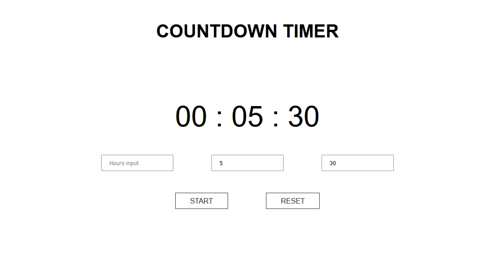

# Countdown-timer
 

 
This is another fairly simple application, but nevertheless, building it provided me lot of usefull practice.
Array.from, forEach, Array.some, Math.trunc, padStart, setInterval, clearInterval, style.pointerEvents, template literals...are few of the methods and features
used to create this project.

If the Start button is clicked with all fields empty, timer will start countdown from default value(1 minute).

HTML, CSS, Vanilla JS
